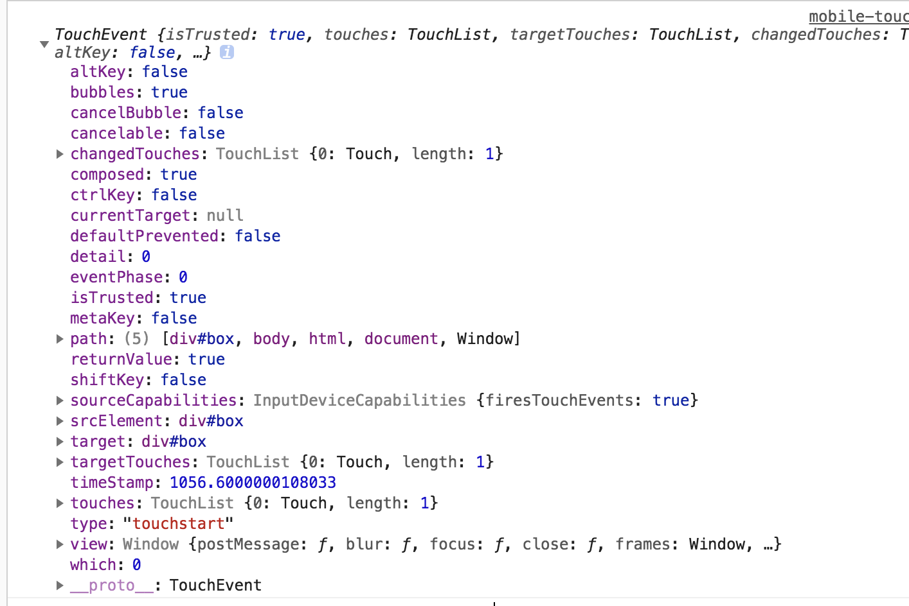
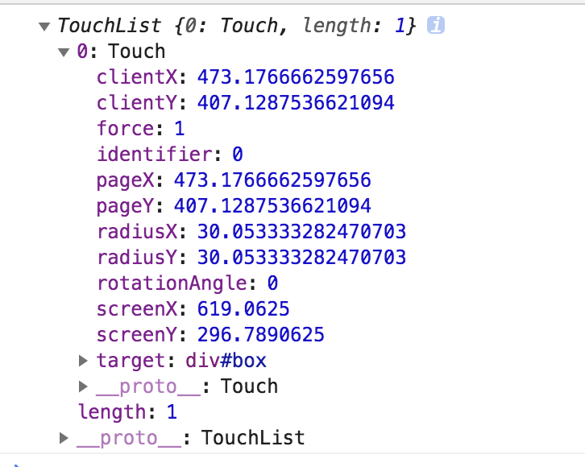
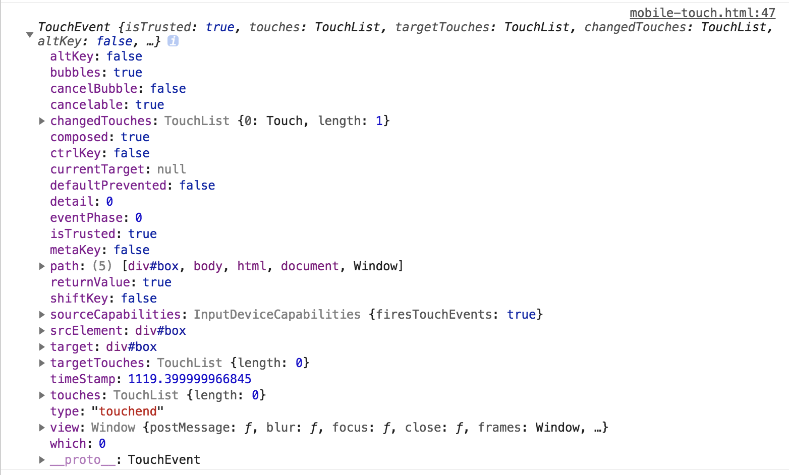

#移动端touch事件
我们在移动端开发时，会发现会遇到一个需求，就是手触摸手机屏幕进行滑动时，发生一系列事情，这里我来系统整理一下touch事件。 

## touch事件
首先，touch事件包含三类事件：  

- touchstart 手指触摸到指定dom元素上被触发
- touchmove 手指在指定dom元素上滑动时被触发
- touchend 手机离开指定的dom元素时被触发

## touch属性
下面是touch的属性截图：


通过这个图，我们可以看到其中有三个属性：

- changeTouches 涉及到当前事件的手指的列表
- targetTouches 正在触摸指定dom的手指的列表
- touches 正在触摸屏幕的所有手指的一个列表

这三个列表的差距非常的细微，首先其属性内部包含的东西都差不多，如图所示：



首先可以看出其是一个数组，现在我们详细介绍这里具体的属性的意思

- clientX 触摸点距离可视区域的水平方向距离
- clinetY 触摸点距离可视区域的垂直方向距离
- screenX 触摸点到屏幕最左边的距离
- screenY 触摸点到屏幕最上方的距离
- pageX 触摸点到网页最上方的距离
- pageY 触摸点到网页最左边的距离
- force 触摸点压力
- identifier 触摸点唯一标识
- radiusX 触摸点椭圆的水平半径
- radiusY 触摸点椭圆的垂直半径
- rotationAngle 旋转角度
- target 触摸目标

### 示例
这里一个小demo，手触摸屏幕，屏幕上显示开始触摸的点的坐标以及水平方向和垂直方向移动的距离
```js
    <div id="box">
        请在移动端，PC上无法查看效果，滑动查看效果
        <div>当前触摸点的横坐标是:<span id="curDisX"></span>，纵坐标是:<span id="curDisY"></span></div>
        <div>水平方向移动的距离是<span id="moveDisX"></span>，垂直方向移动的距离是：<span id="moveDisY"></span></div>
    </div>
    <script>
        var oBox =  document.querySelector('#box');
        var oCurDisX = document.querySelector('#curDisX');
        var oCurDisY = document.querySelector('#curDisY');
        var oMoveDisX = document.querySelector('#moveDisX');
        var oMoveDisY = document.querySelector('#moveDisY');
        var currentX, currentY, moveX, moveY;
        document.addEventListener('touchstart', (e) => {
            console.log(e.touches);
            currentX = e.touches[0].clientX;
            currentY = e.touches[0].clientY;
            oCurDisX.innerHTML = currentX;
            oCurDisY.innerHTML = currentY;
        })
        document.addEventListener('touchmove', (e) => {
            moveX = e.touches[0].clientX - currentX;
            moveY = e.touches[0].clientY - currentY;
            oMoveDisX.innerHTML = moveX;
            oMoveDisY.innerHTML = moveY;
        })
    </script>
```
### 注意事项
在touchend事件中，touches和targetTouches的长度都为0，因为触摸离开时，没有触摸点了，注意前面对touches、targetTouches和changeTouches的定义

   

一个移动端轮播图[收藏链接](http://yunkus.com/demo/mobile-touch-event/)


